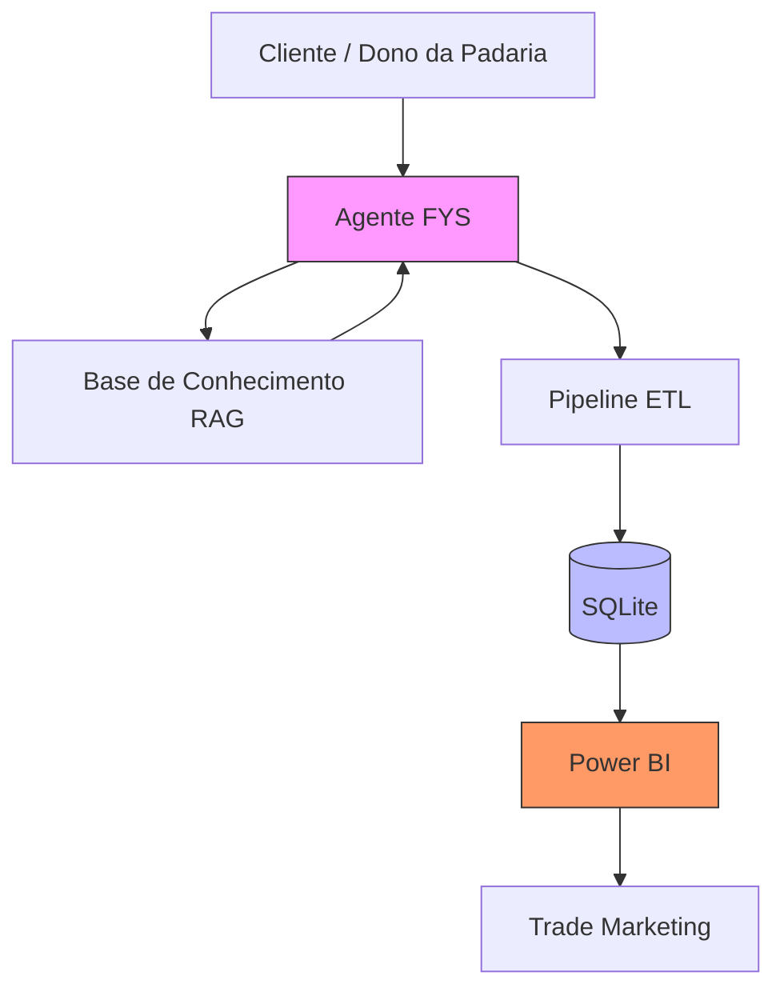

# 🥤 Agente FYS B2B | Copiloto de Vendas com IA

> Projeto desenvolvido para o desafio **"Copiloto de Vendas com IA para Atendimento ao Cliente"** da **DIO**, utilizando a marca **FYS (HEINEKEN)** como contexto de negócio.

O Agente FYS é um copiloto comercial que utiliza Inteligência Artificial para apoiar negociações com padarias, responder objeções utilizando uma base de conhecimento (RAG), registrar informações estruturadas das negociações e disponibilizar esses dados para análises em Business Intelligence.

---

# 🎯 Objetivo

Demonstrar como a IA pode apoiar equipes comerciais em canais pulverizados, automatizando parte do atendimento e transformando conversas em informações estruturadas para apoiar decisões de negócio.

---

# 🚀 O Problema

Durante a live da FYS apresentada no bootcamp da DIO, foi identificado um desafio comum ao varejo de vizinhança:

- baixa presença da marca em padarias;
- limitação da força de vendas para atender milhares de pontos de venda;
- necessidade de responder rapidamente às objeções dos clientes;
- baixo aproveitamento das informações geradas durante as negociações.

Este projeto propõe uma solução baseada em IA para apoiar esse processo comercial.

---

# 💡 A Solução

O Agente FYS atua como um copiloto comercial capaz de:

- apresentar os produtos da marca;
- responder objeções utilizando uma base de conhecimento;
- recomendar produtos do catálogo;
- conduzir negociações simuladas;
- extrair automaticamente informações estruturadas da conversa;
- armazenar os dados para análises futuras.

Embora o desafio pudesse ser resolvido com um chatbot simples, este projeto expande a proposta integrando conceitos de IA Generativa, Engenharia de Prompts, RAG, Pipeline ETL e Business Intelligence.

---

# 🏗️ Arquitetura do Sistema



---

# ✅ Como este projeto atende ao desafio

| Requisito | Implementação |
|-----------|---------------|
| Copiloto de vendas | ✅ Agente conversacional em Python |
| Atendimento ao cliente | ✅ Simulação de negociação comercial |
| Base de conhecimento | ✅ Catálogo de produtos + matriz de objeções |
| IA aplicada | ✅ Google Gemini 2.5 Flash |
| Sugestão de produtos | ✅ Consulta ao catálogo utilizando RAG |
| Tratamento de objeções | ✅ Base de conhecimento estruturada |
| Organização das informações | ✅ Persistência em SQLite |
| Inteligência comercial | ✅ Modelo preparado para Power BI |

---

# 🧠 Base de Conhecimento

A solução utiliza uma base de conhecimento construída a partir da live da **FYS**, organizada em:

- catálogo de produtos;
- matriz de objeções;
- dados do mercado de padarias.

Essas informações são consultadas pelo agente através da estratégia **Retrieval-Augmented Generation (RAG)**, tornando as respostas mais contextualizadas e consistentes.

---

# 💬 Exemplo de Conversa

> **Cliente:** Quero apenas duas caixas de Guaraná.

> **Agente FYS:** Perfeito! Vou registrar duas caixas de FYS Guaraná. Caso tenha interesse, a FYS Laranja possui 10% de suco de fruta e pode complementar seu mix de refrigerantes. Deseja incluir alguma caixa?

> **Cliente:** Não. Somente o Guaraná.

> **Agente FYS:** Pedido registrado! Vou finalizar sua solicitação.

---

# ⚙️ Extração Estruturada (ETL)

Após o encerramento da conversa, o histórico é processado automaticamente.

```text
[Sistema]

✓ Conversa finalizada

✓ Extraindo informações da negociação...

✓ Cliente identificado

✓ Produto identificado

✓ Quantidade identificada

✓ Persistindo dados...

✓ Tabelas clientes, negociacoes e mensagens atualizadas com sucesso.
```

Esse processo transforma uma conversa não estruturada em dados prontos para análise.

---

# 📊 Inteligência de Negócios

Os dados armazenados permitem análises como:

- taxa de conversão;
- produtos mais vendidos;
- principais objeções;
- tempo médio de atendimento;
- quantidade média de interações;
- desempenho das negociações.

Toda a modelagem foi preparada para integração com **Microsoft Power BI**.

---

# 📂 Estrutura do Projeto

```text
.
├── app_local.py
├── core/
├── knowledge/
├── prompts/
├── data_architecture/
├── datasets/
├── automacao_whatsapp/
├── docs/
├── requirements.txt
└── README.md
```

---

# 🛠️ Tecnologias

- Python
- Google Gemini 2.5 Flash
- Engenharia de Prompts
- Retrieval-Augmented Generation (RAG)
- SQLite
- ETL
- Microsoft Power BI
- Mermaid

---

# 🚀 Como executar

## 1. Clone o projeto

```bash
git clone https://github.com/YugoPereira/copiloto-vendas-fiz.git

cd copiloto-vendas-fiz
```

## 2. Instale as dependências

```bash
pip install -r requirements.txt
```

## 3. Configure as credenciais

Crie um arquivo `.env` baseado no `.env.example`:

```env
API_KEY_LLM=sua_chave_api
```

## 4. Execute a aplicação

```bash
python app_local.py
```

---

# 📚 Documentação

A documentação técnica foi organizada separadamente para manter este README objetivo.

| Documento | Descrição |
|-----------|-----------|
| [Arquitetura](docs/arquitetura.md) | Arquitetura da solução e fluxo de dados |
| [Power BI](docs/powerbi.md) | Modelagem analítica e indicadores |
| [Prompts](docs/prompts.md) | Engenharia de Prompts e estratégia RAG |
| [Reflexão](docs/reflexao.md) | Decisões arquiteturais e aprendizados |

---

# 🔒 Segurança

O projeto foi desenvolvido seguindo boas práticas de segurança:

- credenciais armazenadas em variáveis de ambiente;
- arquivo `.env` ignorado pelo Git;
- base de conhecimento separada da lógica da aplicação;
- dados de exemplo utilizados para demonstração.

---
# 🔮 Próximos Passos

- Integração com WhatsApp;
- API REST utilizando FastAPI;
- Dashboard em tempo real;
- Banco PostgreSQL;
- Implantação em nuvem.

---

# 📖 Aprendizados

Durante este projeto foram aplicados conceitos de:

- Inteligência Artificial Generativa;
- Engenharia de Prompts;
- Retrieval-Augmented Generation (RAG);
- Modelagem Relacional;
- Pipeline ETL;
- Business Intelligence;
- Modelagem Dimensional;
- Power BI;
- Automação Comercial.

---

# 👨‍💻 Autor

**Yugo Pereira**

Profissional em transição para as áreas de **Data Analytics**, **Business Intelligence** e **Inteligência Artificial**, desenvolvendo soluções que unem automação, engenharia de dados e IA aplicada aos negócios.